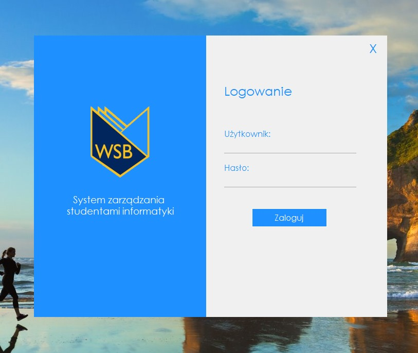
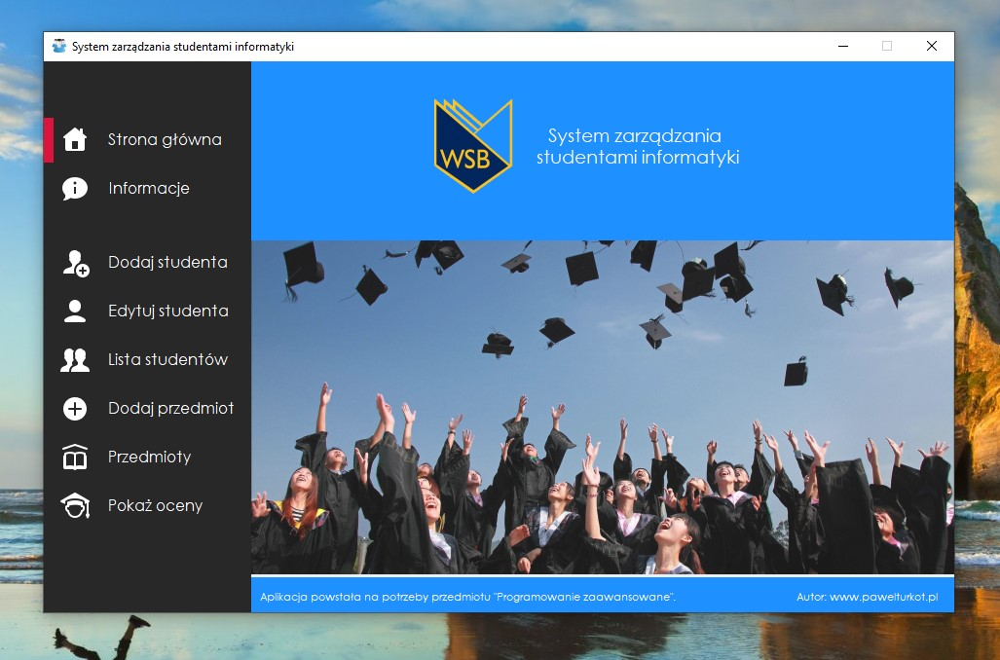
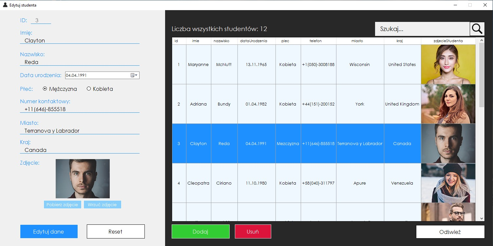
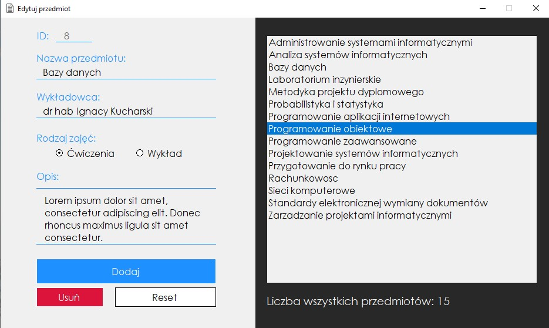

# Mini student information system

> Simple project for college. Created in C# and MySQL

## Features

- Login form
- Add/edit/remove students
- Student list
- Manage scores and subjects

## Status
Project is finished.

## Screenshots

    

    

    

    

### License

MIT
